# Дипломный практикум в Yandex.Cloud
---
## Цели:

1. Подготовить облачную инфраструктуру на базе облачного провайдера Яндекс.Облако.
2. Запустить и сконфигурировать Kubernetes кластер.
3. Установить и настроить систему мониторинга.
4. Настроить и автоматизировать сборку тестового приложения с использованием Docker-контейнеров.
5. Настроить CI для автоматической сборки и тестирования.
6. Настроить CD для автоматического развёртывания приложения.

---
## Этапы выполнения:


### Создание облачной инфраструктуры

Для начала необходимо подготовить облачную инфраструктуру в ЯО при помощи [Terraform](https://www.terraform.io/).

Установим Yandex cloud CLI
```
vlad@DESKTOP-2V70QV1:~/netology$ curl -sSL https://storage.yandexcloud.net/yandexcloud-yc/install.sh | bash
Downloading yc 0.185.0
  % Total    % Received % Xferd  Average Speed   Time    Time     Time  Current
                                 Dload  Upload   Total   Spent    Left  Speed
100  158M  100  158M    0     0  15.0M      0  0:00:10  0:00:10 --:--:-- 16.5M
Yandex Cloud CLI 0.185.0 linux/amd64

yc PATH has been added to your '/home/vlad/.bashrc' profile
yc bash completion has been added to your '/home/vlad/.bashrc' profile.
Now we have zsh completion. Type "echo 'source /home/vlad/yandex-cloud/completion.zsh.inc' >>  ~/.zshrc" to install itTo complete installation, start a new shell (exec -l $SHELL) or type 'source "/home/vlad/.bashrc"' in the current one
vlad@DESKTOP-2V70QV1:~/netology$ source "/home/vlad/.bashrc"
```
Инициализируем Yandex cloud CLI:
```
vlad@DESKTOP-2V70QV1:~/netology$ yc init
Welcome! This command will take you through the configuration process.
...
...
Please enter your numeric choice: 1
Your profile default Compute zone has been set to 'ru-central1-a'.
vlad@DESKTOP-2V70QV1:~/netology$ yc iam service-account create --name terraform-sa

done (2s)
id: axxxxxxxxxxxxxxx2
folder_id: bxxxxxxxxxxxxxxxxx2
created_at: "2025-12-28T10:57:26Z"
name: terraform-sa
```

Предварительная подготовка к установке и запуску Kubernetes кластера.

1. Создадим сервисный аккаунт, который будет в дальнейшем использоваться Terraform для работы с инфраструктурой с необходимыми и достаточными правами. Не стоит использовать права суперпользователя
```

vlad@DESKTOP-2V70QV1:~/netology$ SA_ID=$(yc iam service-account get terraform-sa --format json | jq -r .id)

# Назначение ролей
vlad@DESKTOP-2V70QV1:~/netology$ yc resource-manager folder add-access-binding bxxxxxxxxxxxxx2 \
>   --role editor \
>   --subject serviceAccount:$SA_ID
done (21s)
effective_deltas:
  - action: ADD
    access_binding:
      role_id: editor
      subject:
        id: axxxxxxxxxxxxxxxx2
        type: serviceAccount

# Создание ключа
vlad@DESKTOP-2V70QV1:~/netology$ yc iam key create --service-account-id $SA_ID --output key.json
id: axxxxxxxxxxxxxxxe
service_account_id: axxxxxxxxxxxxxxx2
created_at: "2025-12-28T11:09:33.633843998Z"
key_algorithm: RSA_2048

```

создадим  директорию для terraform инфраструктуры, проверим  глобальную конфигурации Terraform
```
vlad@DESKTOP-2V70QV1:~/netology/devops-diplom-yandexcloud$ mkdir -p terraform/{backend,main,modules}
vlad@DESKTOP-2V70QV1:~/netology/devops-diplom-yandexcloud$ tree -L 2
.
├── README.md
└── terraform
    ├── backend
    ├── main
    └── modules

5 directories, 1 file
vlad@DESKTOP-2V70QV1:~/netology/devops-diplom-yandexcloud$ cat ~/.terraform.d/terraform.rc
provider_installation {
  network_mirror {
    url = "https://terraform-mirror.yandexcloud.net/"
    include = ["registry.terraform.io/*/*"]
  }
  direct {
    exclude = ["registry.terraform.io/*/*"]
  }
}
```
Установим и проверим переменные окуружения
```
vlad@DESKTOP-2V70QV1:~/netology/devops-diplom-yandexcloud$ export TF_VAR_cloud_id=$(yc config get cloud-id)
export TF_VAR_folder_id=$(yc config get folder-id)
export TF_VAR_yc_token=$(yc iam create-token)
export TF_VAR_sa_id=$SA_ID

vlad@DESKTOP-2V70QV1:~/netology/devops-diplom-yandexcloud$ echo "TF_VAR_cloud_id:  $TF_VAR_cloud_id"
echo "TF_VAR_folder_id: $TF_VAR_folder_id"
echo "TF_VAR_sa_id:     $TF_VAR_sa_id"
echo "TF_VAR_yc_token:  $TF_VAR_yc_token"
TF_VAR_cloud_id:  b1gn................
TF_VAR_folder_id: b1g2................
TF_VAR_sa_id:     ajef................
TF_VAR_yc_token:  t1.9..........................................................
```


Создаем корневую директорию проекта
```
mkdir -p ~/devops-diplom-yandexcloud
cd ~/devops-diplom-yandexcloud
```
Создаем структуру для backend
```
mkdir -p terraform/backend
cd terraform/backend
```
Создаем файл variables.tf для backend
```
vlad@DESKTOP-2V70QV1:~/devops-diplom-yandexcloud/terraform/backend$ cat variables.tf 
variable "folder_id" {
  description = "Yandex Cloud Folder ID"
  type        = string
  sensitive   = false
}

variable "sa_id" {
  description = "Service Account ID"
  type        = string
  sensitive   = false
}

variable "yc_token" {
  description = "IAM Token for Yandex Cloud"
  type        = string
  sensitive   = true
}

variable "cloud_id" {
  description = "Yandex Cloud ID"
  type        = string
  sensitive   = false
}

variable "default_zone" {
  type    = string
  default = "ru-central1-a"
}

variable "sa_name" {
  type    = string
  default = "terraform-sa"
}

variable "bucket_name" {
  type    = string
  default = "netology-diploma-vladyezh-tfstate"
}
```
Создаем файл providers.tf для backend
```
vlad@DESKTOP-2V70QV1:~/devops-diplom-yandexcloud/terraform/backend$ cat providers.tf 
terraform {
  required_providers {
    yandex = {
      source = "yandex-cloud/yandex"
    }
  }
  required_version = ">= 0.13"
}

provider "yandex" {
  token     = var.yc_token
  cloud_id  = var.cloud_id
  folder_id = var.folder_id
  zone      = var.default_zone
}
```


2. Подготовим  backend для Terraform - S3 bucket в созданном ЯО аккаунте(создание бакета через TF)
```
vlad@DESKTOP-2V70QV1:~/devops-diplom-yandexcloud/terraform/backend$ cat main.tf 
# Создание бакета для Terraform state
resource "yandex_storage_bucket" "terraform_state" {
  bucket    = var.bucket_name
  folder_id = var.folder_id
  acl       = "private"

  versioning {
    enabled = true
  }

}

output "bucket_id" {
  value = yandex_storage_bucket.terraform_state.id
}
vlad@DESKTOP-2V70QV1:~/devops-diplom-yandexcloud/terraform/backend$ cat providers.tf 
terraform {
  required_providers {
    yandex = {
      source = "yandex-cloud/yandex"
    }
  }
  required_version = ">= 0.13"
}

provider "yandex" {
  token     = var.yc_token
  cloud_id  = var.cloud_id
  folder_id = var.folder_id
  zone      = var.default_zone
}
```


```
vlad@DESKTOP-2V70QV1:~/devops-diplom-yandexcloud/terraform/backend$ terraform   plan

Terraform used the selected providers to generate the following execution plan. Resource actions are indicated with the following symbols:
  + create

Terraform will perform the following actions:

  # yandex_storage_bucket.terraform_state will be created
  + resource "yandex_storage_bucket" "terraform_state" {
      + acl                   = "private"
      + bucket                = "netology-diploma-vladyezh-tfstate"
      + bucket_domain_name    = (known after apply)
      + default_storage_class = (known after apply)
      + folder_id             = "b...............s2"
      + force_destroy         = false
      + id                    = (known after apply)
      + policy                = (known after apply)
      + website_domain        = (known after apply)
      + website_endpoint      = (known after apply)

      + anonymous_access_flags (known after apply)

      + grant (known after apply)

      + versioning {
          + enabled = true
        }
    }

Plan: 1 to add, 0 to change, 0 to destroy.

Changes to Outputs:
  + bucket_id   = (known after apply)
  - bucket_name = "netology-diploma-tfstate-$(substr(md5(var.folder_id), 0, 8))" -> null
╷
│ Warning: Argument is deprecated
│ 
│   with yandex_storage_bucket.terraform_state,
│   on main.tf line 5, in resource "yandex_storage_bucket" "terraform_state":
│    5:   acl       = "private"
│ 
│ Use `yandex_storage_bucket_grant` instead.
╵

─────────────────────────────────────────────────────────────────────────────────────────────────────────────────────────────────────────────────────────────────────────────

Note: You didn't use the -out option to save this plan, so Terraform can't guarantee to take exactly these actions if you run "terraform apply" now.
vlad@DESKTOP-2V70QV1:~/devops-diplom-yandexcloud/terraform/backend$ terraform apply

Terraform used the selected providers to generate the following execution plan. Resource actions are indicated with the following symbols:
  + create

Terraform will perform the following actions:

  # yandex_storage_bucket.terraform_state will be created
  + resource "yandex_storage_bucket" "terraform_state" {
      + acl                   = "private"
      + bucket                = "netology-diploma-vladyezh-tfstate"
      + bucket_domain_name    = (known after apply)
      + default_storage_class = (known after apply)
      + folder_id             = "b..............2"
      + force_destroy         = false
      + id                    = (known after apply)
      + policy                = (known after apply)
      + website_domain        = (known after apply)
      + website_endpoint      = (known after apply)

      + anonymous_access_flags (known after apply)

      + grant (known after apply)

      + versioning {
          + enabled = true
        }
    }

Plan: 1 to add, 0 to change, 0 to destroy.

Changes to Outputs:
  + bucket_id   = (known after apply)
  - bucket_name = "netology-diploma-tfstate-$(substr(md5(var.folder_id), 0, 8))" -> null
╷
│ Warning: Argument is deprecated
│ 
│   with yandex_storage_bucket.terraform_state,
│   on main.tf line 5, in resource "yandex_storage_bucket" "terraform_state":
│    5:   acl       = "private"
│ 
│ Use `yandex_storage_bucket_grant` instead.
│ 
│ (and one more similar warning elsewhere)
╵

Do you want to perform these actions?
  Terraform will perform the actions described above.
  Only 'yes' will be accepted to approve.

  Enter a value: yes

yandex_storage_bucket.terraform_state: Creating...
yandex_storage_bucket.terraform_state: Still creating... [00m10s elapsed]
yandex_storage_bucket.terraform_state: Creation complete after 14s [id=netology-diploma-vladyezh-tfstate]
╷
│ Warning: Argument is deprecated
│ 
│   with yandex_storage_bucket.terraform_state,
│   on main.tf line 5, in resource "yandex_storage_bucket" "terraform_state":
│    5:   acl       = "private"
│ 
│ Use `yandex_storage_bucket_grant` instead.
╵

Apply complete! Resources: 1 added, 0 changed, 0 destroyed.

Outputs:

bucket_id = "netology-diploma-vladyezh-tfstate"
```
3. Создадим конфигурацию Terrafrom, используя созданный бакет ранее как бекенд для хранения стейт файла. Конфигурации Terraform для создания сервисного аккаунта и бакета и основной инфраструктуры следует сохранить в разных папках.
```
# Создадим статический ключ доступа
vlad@DESKTOP-2V70QV1:~/devops-diplom-yandexcloud/terraform/main$ yc iam access-key create --service-account-name terraform-sa
access_key:
  id: ajea0k1jp13oiorgpc10
  service_account_id: aj..............
  created_at: "2025-12-29T23:14:46.236576138Z"
  key_id: YCA...................
  secret: YCP......................

# Экспортируем ключи в переменные окружения:
vlad@DESKTOP-2V70QV1:~/devops-diplom-yandexcloud/terraform/main$ export ACCESS_KEY="YCA................."
vlad@DESKTOP-2V70QV1:~/devops-diplom-yandexcloud/terraform/main$ export SECRET_KEY="YCP..................................."
```
4. Создадим VPC с подсетями в разных зонах доступности.
```
# Перейдем в директорию main
cd ..
mkdir -p main
cd main

vlad@DESKTOP-2V70QV1:~/netology/devops-diplom-yandexcloud/terraform/mainfor file in *.tf; do echo "=== $file ==="; cat "$file"; echo; donene
=== backend.tf ===

terraform {
  backend "s3" {
    endpoints = {
      s3 = "https://storage.yandexcloud.net"
    }
    bucket                      = "netology-diploma-vladyezh-tfstate"
    region                      = "ru-central1"
    key                         = "main/terraform.tfstate"
    skip_region_validation      = true
    skip_credentials_validation = true
    skip_requesting_account_id  = true
    skip_s3_checksum            = true
  }
}

=== debug.tf ===
output "debug_vars" {
  value = {
    token_length   = length(var.yc_token)
    token_first_10 = substr(var.yc_token, 0, 10)
    cloud_id       = var.cloud_id
    folder_id      = var.folder_id
    zone           = var.default_zone
  }
  sensitive = true # To avoid exposing full token
}


=== main.tf ===


=== outputs.tf ===
output "network_id" {
  description = "ID of the VPC network"
  value       = yandex_vpc_network.k8s_network.id
}

output "network_name" {
  description = "Name of the VPC network"
  value       = yandex_vpc_network.k8s_network.name
}

output "subnet_a_id" {
  description = "ID of subnet in zone a"
  value       = yandex_vpc_subnet.k8s_subnet_a.id
}

output "subnet_b_id" {
  description = "ID of subnet in zone b"
  value       = yandex_vpc_subnet.k8s_subnet_b.id
}

output "subnet_d_id" {
  description = "ID of subnet in zone d"
  value       = yandex_vpc_subnet.k8s_subnet_d.id
}

output "subnets_map" {
  description = "Map of all subnets with zones as keys"
  value = {
    "ru-central1-a" = yandex_vpc_subnet.k8s_subnet_a.id
    "ru-central1-b" = yandex_vpc_subnet.k8s_subnet_b.id
    "ru-central1-d" = yandex_vpc_subnet.k8s_subnet_d.id
  }
}

output "subnet_cidrs" {
  description = "CIDR blocks of all subnets"
  value = {
    "ru-central1-a" = yandex_vpc_subnet.k8s_subnet_a.v4_cidr_blocks
    "ru-central1-b" = yandex_vpc_subnet.k8s_subnet_b.v4_cidr_blocks
    "ru-central1-d" = yandex_vpc_subnet.k8s_subnet_d.v4_cidr_blocks
  }
}


output "subnet_ids" {
  value = {
    a = yandex_vpc_subnet.k8s_subnet_a.id
    b = yandex_vpc_subnet.k8s_subnet_b.id
    d = yandex_vpc_subnet.k8s_subnet_d.id
  }
}

=== providers.tf ===
terraform {
  required_providers {
    yandex = {
      source = "yandex-cloud/yandex"
    }
  }
  required_version = ">= 0.13"

}

provider "yandex" {
  token     = var.yc_token
  cloud_id  = var.cloud_id
  folder_id = var.folder_id
  zone      = var.default_zone
}


=== variables.tf ===
variable "folder_id" {
  description = "Yandex Cloud Folder ID"
  type        = string
  sensitive   = false
}

variable "sa_id" {
  description = "Service Account ID"
  type        = string
  sensitive   = false
}

variable "yc_token" {
  description = "IAM Token for Yandex Cloud"
  type        = string
  sensitive   = true
}

variable "cloud_id" {
  description = "Yandex Cloud ID"
  type        = string
  sensitive   = false
}

variable "default_zone" {
  type    = string
  default = "ru-central1-a"
}

variable "sa_name" {
  type    = string
  default = "terraform-sa"
}

variable "bucket_name" {
  type    = string
  default = "netology-diploma-vladyezh-tfstate"
}

variable "access_key" {
  type      = string
  sensitive = true
}

variable "secret_key" {
  type      = string
  sensitive = true
}

=== vpc.tf ===
resource "yandex_vpc_network" "k8s_network" {
  name        = "k8s-network"
  description = "Network for Kubernetes cluster"
  labels = {
    environment = "diploma"
    managed_by  = "terraform"
  }
}

resource "yandex_vpc_subnet" "k8s_subnet_a" {
  name           = "k8s-subnet-a"
  zone           = "ru-central1-a"
  network_id     = yandex_vpc_network.k8s_network.id
  v4_cidr_blocks = ["10.0.1.0/24"]
  labels = {
    environment = "diploma"
    zone        = "a"
  }
}

resource "yandex_vpc_subnet" "k8s_subnet_b" {
  name           = "k8s-subnet-b"
  zone           = "ru-central1-b"
  network_id     = yandex_vpc_network.k8s_network.id
  v4_cidr_blocks = ["10.0.2.0/24"]
  labels = {
    environment = "diploma"
    zone        = "b"
  }
}

resource "yandex_vpc_subnet" "k8s_subnet_d" {
  name           = "k8s-subnet-d"
  zone           = "ru-central1-d"
  network_id     = yandex_vpc_network.k8s_network.id
  v4_cidr_blocks = ["10.0.3.0/24"]
  labels = {
    environment = "diploma"
    zone        = "d"
  }
}

```
5. Убедитесь, что теперь вы можете выполнить команды `terraform destroy` и `terraform apply` без дополнительных ручных действий.
```
vlad@DESKTOP-2V70QV1:~/netology/devops-diplom-yandexcloud/terraform/main$ terraform  plan

Terraform used the selected providers to generate the following execution plan. Resource actions are indicated with the following symbols:
  + create

Terraform will perform the following actions:

  # yandex_vpc_network.k8s_network will be created
  + resource "yandex_vpc_network" "k8s_network" {
      + created_at                = (known after apply)
      + default_security_group_id = (known after apply)
      + description               = "Network for Kubernetes cluster"
      + folder_id                 = (known after apply)
      + id                        = (known after apply)
      + labels                    = {
          + "environment" = "diploma"
          + "managed_by"  = "terraform"
        }
      + name                      = "k8s-network"
      + subnet_ids                = (known after apply)
    }

  # yandex_vpc_subnet.k8s_subnet_a will be created
  + resource "yandex_vpc_subnet" "k8s_subnet_a" {
      + created_at     = (known after apply)
      + folder_id      = (known after apply)
      + id             = (known after apply)
      + labels         = {
          + "environment" = "diploma"
          + "zone"        = "a"
        }
      + name           = "k8s-subnet-a"
      + network_id     = (known after apply)
      + v4_cidr_blocks = [
          + "10.0.1.0/24",
        ]
      + v6_cidr_blocks = (known after apply)
      + zone           = "ru-central1-a"
    }

  # yandex_vpc_subnet.k8s_subnet_b will be created
  + resource "yandex_vpc_subnet" "k8s_subnet_b" {
      + created_at     = (known after apply)
      + folder_id      = (known after apply)
      + id             = (known after apply)
      + labels         = {
          + "environment" = "diploma"
          + "zone"        = "b"
        }
      + name           = "k8s-subnet-b"
      + network_id     = (known after apply)
      + v4_cidr_blocks = [
          + "10.0.2.0/24",
        ]
      + v6_cidr_blocks = (known after apply)
      + zone           = "ru-central1-b"
    }

  # yandex_vpc_subnet.k8s_subnet_d will be created
  + resource "yandex_vpc_subnet" "k8s_subnet_d" {
      + created_at     = (known after apply)
      + folder_id      = (known after apply)
      + id             = (known after apply)
      + labels         = {
          + "environment" = "diploma"
          + "zone"        = "d"
        }
      + name           = "k8s-subnet-d"
      + network_id     = (known after apply)
      + v4_cidr_blocks = [
          + "10.0.3.0/24",
        ]
      + v6_cidr_blocks = (known after apply)
      + zone           = "ru-central1-d"
    }

Plan: 4 to add, 0 to change, 0 to destroy.

Changes to Outputs:
  + network_id   = (known after apply)
  + subnet_a_id  = (known after apply)
  + subnet_b_id  = (known after apply)
  + subnet_d_id  = (known after apply)
  + subnet_ids   = {
      + a = (known after apply)
      + b = (known after apply)
      + d = (known after apply)
    }
  + subnets_map  = {
      + ru-central1-a = (known after apply)
      + ru-central1-b = (known after apply)
      + ru-central1-d = (known after apply)
    }

────────────────────────────────────────────────────────────────────────────────────────────────────────────────────────────────────────────────────────────────────────────────

Note: You didn't use the -out option to save this plan, so Terraform can't guarantee to take exactly these actions if you run "terraform apply" now.
vlad@DESKTOP-2V70QV1:~/netology/devops-diplom-yandexcloud/terraform/main$ terraform   apply

Terraform used the selected providers to generate the following execution plan. Resource actions are indicated with the following symbols:
  + create

Terraform will perform the following actions:

  # yandex_vpc_network.k8s_network will be created
  + resource "yandex_vpc_network" "k8s_network" {
      + created_at                = (known after apply)
      + default_security_group_id = (known after apply)
      + description               = "Network for Kubernetes cluster"
      + folder_id                 = (known after apply)
      + id                        = (known after apply)
      + labels                    = {
          + "environment" = "diploma"
          + "managed_by"  = "terraform"
        }
      + name                      = "k8s-network"
      + subnet_ids                = (known after apply)
    }

  # yandex_vpc_subnet.k8s_subnet_a will be created
  + resource "yandex_vpc_subnet" "k8s_subnet_a" {
      + created_at     = (known after apply)
      + folder_id      = (known after apply)
      + id             = (known after apply)
      + labels         = {
          + "environment" = "diploma"
          + "zone"        = "a"
        }
      + name           = "k8s-subnet-a"
      + network_id     = (known after apply)
      + v4_cidr_blocks = [
          + "10.0.1.0/24",
        ]
      + v6_cidr_blocks = (known after apply)
      + zone           = "ru-central1-a"
    }

  # yandex_vpc_subnet.k8s_subnet_b will be created
  + resource "yandex_vpc_subnet" "k8s_subnet_b" {
      + created_at     = (known after apply)
      + folder_id      = (known after apply)
      + id             = (known after apply)
      + labels         = {
          + "environment" = "diploma"
          + "zone"        = "b"
        }
      + name           = "k8s-subnet-b"
      + network_id     = (known after apply)
      + v4_cidr_blocks = [
          + "10.0.2.0/24",
        ]
      + v6_cidr_blocks = (known after apply)
      + zone           = "ru-central1-b"
    }

  # yandex_vpc_subnet.k8s_subnet_d will be created
  + resource "yandex_vpc_subnet" "k8s_subnet_d" {
      + created_at     = (known after apply)
      + folder_id      = (known after apply)
      + id             = (known after apply)
      + labels         = {
          + "environment" = "diploma"
          + "zone"        = "d"
        }
      + name           = "k8s-subnet-d"
      + network_id     = (known after apply)
      + v4_cidr_blocks = [
          + "10.0.3.0/24",
        ]
      + v6_cidr_blocks = (known after apply)
      + zone           = "ru-central1-d"
    }

Plan: 4 to add, 0 to change, 0 to destroy.

Changes to Outputs:
  + network_id   = (known after apply)
  + subnet_a_id  = (known after apply)
  + subnet_b_id  = (known after apply)
  + subnet_d_id  = (known after apply)
  + subnet_ids   = {
      + a = (known after apply)
      + b = (known after apply)
      + d = (known after apply)
    }
  + subnets_map  = {
      + ru-central1-a = (known after apply)
      + ru-central1-b = (known after apply)
      + ru-central1-d = (known after apply)
    }

Do you want to perform these actions?
  Terraform will perform the actions described above.
  Only 'yes' will be accepted to approve.

  Enter a value: yes

yandex_vpc_network.k8s_network: Creating...
yandex_vpc_network.k8s_network: Creation complete after 3s [id=enp3bbgb556ug9i0hk75]
yandex_vpc_subnet.k8s_subnet_b: Creating...
yandex_vpc_subnet.k8s_subnet_d: Creating...
yandex_vpc_subnet.k8s_subnet_a: Creating...
yandex_vpc_subnet.k8s_subnet_b: Creation complete after 0s [id=e2lrb4k52dc91ek05hg5]
yandex_vpc_subnet.k8s_subnet_d: Creation complete after 1s [id=fl8g53r890sgc69gbd8m]
yandex_vpc_subnet.k8s_subnet_a: Creation complete after 1s [id=e9b07fi6obdt6nhikc82]

Apply complete! Resources: 4 added, 0 changed, 0 destroyed.

Outputs:

debug_vars = <sensitive>
network_id = "enp3bbgb556ug9i0hk75"
network_name = "k8s-network"
subnet_a_id = "e9b07fi6obdt6nhikc82"
subnet_b_id = "e2lrb4k52dc91ek05hg5"
subnet_cidrs = {
  "ru-central1-a" = tolist([
    "10.0.1.0/24",
  ])
  "ru-central1-b" = tolist([
    "10.0.2.0/24",
  ])
  "ru-central1-d" = tolist([
    "10.0.3.0/24",
  ])
}
subnet_d_id = "fl8g53r890sgc69gbd8m"
subnet_ids = {
  "a" = "e9b07fi6obdt6nhikc82"
  "b" = "e2lrb4k52dc91ek05hg5"
  "d" = "fl8g53r890sgc69gbd8m"
}
subnets_map = {
  "ru-central1-a" = "e9b07fi6obdt6nhikc82"
  "ru-central1-b" = "e2lrb4k52dc91ek05hg5"
  "ru-central1-d" = "fl8g53r890sgc69gbd8m"
}
```

```
vlad@DESKTOP-2V70QV1:~/netology/devops-diplom-yandexcloud/terraform/main$ terraform destroy
yandex_vpc_network.k8s_network: Refreshing state... [id=enp3bbgb556ug9i0hk75]
yandex_vpc_subnet.k8s_subnet_b: Refreshing state... [id=e2lrb4k52dc91ek05hg5]
yandex_vpc_subnet.k8s_subnet_a: Refreshing state... [id=e9b07fi6obdt6nhikc82]
yandex_vpc_subnet.k8s_subnet_d: Refreshing state... [id=fl8g53r890sgc69gbd8m]

Terraform used the selected providers to generate the following execution plan. Resource actions are indicated with the following symbols:
  - destroy

Terraform will perform the following actions:

  # yandex_vpc_network.k8s_network will be destroyed
  - resource "yandex_vpc_network" "k8s_network" {
      - created_at                = "2025-12-30T14:24:16Z" -> null
      - default_security_group_id = "enprisdkk99fahim7gds" -> null
      - description               = "Network for Kubernetes cluster" -> null
      - folder_id                 = "b1g2ll8gqs3068utaas2" -> null
      - id                        = "enp3bbgb556ug9i0hk75" -> null
      - labels                    = {
          - "environment" = "diploma"
          - "managed_by"  = "terraform"
        } -> null
      - name                      = "k8s-network" -> null
      - subnet_ids                = [
          - "e2lrb4k52dc91ek05hg5",
          - "e9b07fi6obdt6nhikc82",
          - "fl8g53r890sgc69gbd8m",
        ] -> null
    }

  # yandex_vpc_subnet.k8s_subnet_a will be destroyed
  - resource "yandex_vpc_subnet" "k8s_subnet_a" {
      - created_at     = "2025-12-30T14:24:20Z" -> null
      - folder_id      = "b1g2ll8gqs3068utaas2" -> null
      - id             = "e9b07fi6obdt6nhikc82" -> null
      - labels         = {
          - "environment" = "diploma"
          - "zone"        = "a"
        } -> null
      - name           = "k8s-subnet-a" -> null
      - network_id     = "enp3bbgb556ug9i0hk75" -> null
      - v4_cidr_blocks = [
          - "10.0.1.0/24",
        ] -> null
      - v6_cidr_blocks = [] -> null
      - zone           = "ru-central1-a" -> null
        # (2 unchanged attributes hidden)
    }

  # yandex_vpc_subnet.k8s_subnet_b will be destroyed
  - resource "yandex_vpc_subnet" "k8s_subnet_b" {
      - created_at     = "2025-12-30T14:24:19Z" -> null
      - folder_id      = "b1g2ll8gqs3068utaas2" -> null
      - id             = "e2lrb4k52dc91ek05hg5" -> null
      - labels         = {
          - "environment" = "diploma"
          - "zone"        = "b"
        } -> null
      - name           = "k8s-subnet-b" -> null
      - network_id     = "enp3bbgb556ug9i0hk75" -> null
      - v4_cidr_blocks = [
          - "10.0.2.0/24",
        ] -> null
      - v6_cidr_blocks = [] -> null
      - zone           = "ru-central1-b" -> null
        # (2 unchanged attributes hidden)
    }

  # yandex_vpc_subnet.k8s_subnet_d will be destroyed
  - resource "yandex_vpc_subnet" "k8s_subnet_d" {
      - created_at     = "2025-12-30T14:24:19Z" -> null
      - folder_id      = "b1g2ll8gqs3068utaas2" -> null
      - id             = "fl8g53r890sgc69gbd8m" -> null
      - labels         = {
          - "environment" = "diploma"
          - "zone"        = "d"
        } -> null
      - name           = "k8s-subnet-d" -> null
      - network_id     = "enp3bbgb556ug9i0hk75" -> null
      - v4_cidr_blocks = [
          - "10.0.3.0/24",
        ] -> null
      - v6_cidr_blocks = [] -> null
      - zone           = "ru-central1-d" -> null
        # (2 unchanged attributes hidden)
    }

Plan: 0 to add, 0 to change, 4 to destroy.

Changes to Outputs:
  - debug_vars   = (sensitive value) -> null
  - network_id   = "enp3bbgb556ug9i0hk75" -> null
  - network_name = "k8s-network" -> null
  - subnet_a_id  = "e9b07fi6obdt6nhikc82" -> null
  - subnet_b_id  = "e2lrb4k52dc91ek05hg5" -> null
  - subnet_cidrs = {
      - ru-central1-a = [
          - "10.0.1.0/24",
        ]
      - ru-central1-b = [
          - "10.0.2.0/24",
        ]
      - ru-central1-d = [
          - "10.0.3.0/24",
        ]
    } -> null
  - subnet_d_id  = "fl8g53r890sgc69gbd8m" -> null
  - subnet_ids   = {
      - a = "e9b07fi6obdt6nhikc82"
      - b = "e2lrb4k52dc91ek05hg5"
      - d = "fl8g53r890sgc69gbd8m"
    } -> null
  - subnets_map  = {
      - ru-central1-a = "e9b07fi6obdt6nhikc82"
      - ru-central1-b = "e2lrb4k52dc91ek05hg5"
      - ru-central1-d = "fl8g53r890sgc69gbd8m"
    } -> null

Do you really want to destroy all resources?
  Terraform will destroy all your managed infrastructure, as shown above.
  There is no undo. Only 'yes' will be accepted to confirm.

  Enter a value: yes

yandex_vpc_subnet.k8s_subnet_d: Destroying... [id=fl8g53r890sgc69gbd8m]
yandex_vpc_subnet.k8s_subnet_b: Destroying... [id=e2lrb4k52dc91ek05hg5]
yandex_vpc_subnet.k8s_subnet_a: Destroying... [id=e9b07fi6obdt6nhikc82]
yandex_vpc_subnet.k8s_subnet_b: Destruction complete after 1s
yandex_vpc_subnet.k8s_subnet_a: Destruction complete after 1s
yandex_vpc_subnet.k8s_subnet_d: Destruction complete after 1s
yandex_vpc_network.k8s_network: Destroying... [id=enp3bbgb556ug9i0hk75]
yandex_vpc_network.k8s_network: Destruction complete after 1s

Destroy complete! Resources: 4 destroyed.
vlad@DESKTOP-2V70QV1:~/netology/devops-diplom-yandexcloud/terraform/main$ terraform apply

Terraform used the selected providers to generate the following execution plan. Resource actions are indicated with the following symbols:
  + create

Terraform will perform the following actions:

  # yandex_vpc_network.k8s_network will be created
  + resource "yandex_vpc_network" "k8s_network" {
      + created_at                = (known after apply)
      + default_security_group_id = (known after apply)
      + description               = "Network for Kubernetes cluster"
      + folder_id                 = (known after apply)
      + id                        = (known after apply)
      + labels                    = {
          + "environment" = "diploma"
          + "managed_by"  = "terraform"
        }
      + name                      = "k8s-network"
      + subnet_ids                = (known after apply)
    }

  # yandex_vpc_subnet.k8s_subnet_a will be created
  + resource "yandex_vpc_subnet" "k8s_subnet_a" {
      + created_at     = (known after apply)
      + folder_id      = (known after apply)
      + id             = (known after apply)
      + labels         = {
          + "environment" = "diploma"
          + "zone"        = "a"
        }
      + name           = "k8s-subnet-a"
      + network_id     = (known after apply)
      + v4_cidr_blocks = [
          + "10.0.1.0/24",
        ]
      + v6_cidr_blocks = (known after apply)
      + zone           = "ru-central1-a"
    }

  # yandex_vpc_subnet.k8s_subnet_b will be created
  + resource "yandex_vpc_subnet" "k8s_subnet_b" {
      + created_at     = (known after apply)
      + folder_id      = (known after apply)
      + id             = (known after apply)
      + labels         = {
          + "environment" = "diploma"
          + "zone"        = "b"
        }
      + name           = "k8s-subnet-b"
      + network_id     = (known after apply)
      + v4_cidr_blocks = [
          + "10.0.2.0/24",
        ]
      + v6_cidr_blocks = (known after apply)
      + zone           = "ru-central1-b"
    }

  # yandex_vpc_subnet.k8s_subnet_d will be created
  + resource "yandex_vpc_subnet" "k8s_subnet_d" {
      + created_at     = (known after apply)
      + folder_id      = (known after apply)
      + id             = (known after apply)
      + labels         = {
          + "environment" = "diploma"
          + "zone"        = "d"
        }
      + name           = "k8s-subnet-d"
      + network_id     = (known after apply)
      + v4_cidr_blocks = [
          + "10.0.3.0/24",
        ]
      + v6_cidr_blocks = (known after apply)
      + zone           = "ru-central1-d"
    }

Plan: 4 to add, 0 to change, 0 to destroy.

Changes to Outputs:
  + debug_vars   = (sensitive value)
  + network_id   = (known after apply)
  + network_name = "k8s-network"
  + subnet_a_id  = (known after apply)
  + subnet_b_id  = (known after apply)
  + subnet_cidrs = {
      + ru-central1-a = [
          + "10.0.1.0/24",
        ]
      + ru-central1-b = [
          + "10.0.2.0/24",
        ]
      + ru-central1-d = [
          + "10.0.3.0/24",
        ]
    }
  + subnet_d_id  = (known after apply)
  + subnet_ids   = {
      + a = (known after apply)
      + b = (known after apply)
      + d = (known after apply)
    }
  + subnets_map  = {
      + ru-central1-a = (known after apply)
      + ru-central1-b = (known after apply)
      + ru-central1-d = (known after apply)
    }

Do you want to perform these actions?
  Terraform will perform the actions described above.
  Only 'yes' will be accepted to approve.

  Enter a value: yes

yandex_vpc_network.k8s_network: Creating...
yandex_vpc_network.k8s_network: Creation complete after 2s [id=enp6u38gjosccsu8os5i]
yandex_vpc_subnet.k8s_subnet_b: Creating...
yandex_vpc_subnet.k8s_subnet_a: Creating...
yandex_vpc_subnet.k8s_subnet_d: Creating...
yandex_vpc_subnet.k8s_subnet_a: Creation complete after 1s [id=e9bgttt1d727pctek04v]
yandex_vpc_subnet.k8s_subnet_b: Creation complete after 3s [id=e2lo8tpvp7m0no6vgv8b]
yandex_vpc_subnet.k8s_subnet_d: Creation complete after 3s [id=fl8f6djca8pvq9ccq8d5]

Apply complete! Resources: 4 added, 0 changed, 0 destroyed.

Outputs:

debug_vars = <sensitive>
network_id = "enp6u38gjosccsu8os5i"
network_name = "k8s-network"
subnet_a_id = "e9bgttt1d727pctek04v"
subnet_b_id = "e2lo8tpvp7m0no6vgv8b"
subnet_cidrs = {
  "ru-central1-a" = tolist([
    "10.0.1.0/24",
  ])
  "ru-central1-b" = tolist([
    "10.0.2.0/24",
  ])
  "ru-central1-d" = tolist([
    "10.0.3.0/24",
  ])
}
subnet_d_id = "fl8f6djca8pvq9ccq8d5"
subnet_ids = {
  "a" = "e9bgttt1d727pctek04v"
  "b" = "e2lo8tpvp7m0no6vgv8b"
  "d" = "fl8f6djca8pvq9ccq8d5"
}
subnets_map = {
  "ru-central1-a" = "e9bgttt1d727pctek04v"
  "ru-central1-b" = "e2lo8tpvp7m0no6vgv8b"
  "ru-central1-d" = "fl8f6djca8pvq9ccq8d5"
}
```
Результаты:
```
vlad@DESKTOP-2V70QV1:~/netology/devops-diplom-yandexcloud/terraform/main$ yc vpc network list
yc vpc subnet list
+----------------------+-------------+
|          ID          |    NAME     |
+----------------------+-------------+
| enp6u38gjosccsu8os5i | k8s-network |
+----------------------+-------------+

+----------------------+--------------+----------------------+----------------+---------------+---------------+
|          ID          |     NAME     |      NETWORK ID      | ROUTE TABLE ID |     ZONE      |     RANGE     |
+----------------------+--------------+----------------------+----------------+---------------+---------------+
| e2lo8tpvp7m0no6vgv8b | k8s-subnet-b | enp6u38gjosccsu8os5i |                | ru-central1-b | [10.0.2.0/24] |
| e9bgttt1d727pctek04v | k8s-subnet-a | enp6u38gjosccsu8os5i |                | ru-central1-a | [10.0.1.0/24] |
| fl8f6djca8pvq9ccq8d5 | k8s-subnet-d | enp6u38gjosccsu8os5i |                | ru-central1-d | [10.0.3.0/24] |
+----------------------+--------------+----------------------+----------------+---------------+---------------+
```


---
### Создание Kubernetes кластера

На этом этапе необходимо создать [Kubernetes](https://kubernetes.io/ru/docs/concepts/overview/what-is-kubernetes/) кластер на базе предварительно созданной инфраструктуры.   Требуется обеспечить доступ к ресурсам из Интернета.
Это можно сделать двумя способами:
1. Рекомендуемый вариант: самостоятельная установка Kubernetes кластера.  
   а. При помощи Terraform подготовить как минимум 3 виртуальных машины Compute Cloud для создания Kubernetes-кластера. Тип виртуальной машины следует выбрать самостоятельно с учётом требовании к производительности и стоимости. Если в дальнейшем поймете, что необходимо сменить тип инстанса, используйте Terraform для внесения изменений.  
   б. Подготовить [ansible](https://www.ansible.com/) конфигурации, можно воспользоваться, например [Kubespray](https://kubernetes.io/docs/setup/production-environment/tools/kubespray/)  
   в. Задеплоить Kubernetes на подготовленные ранее инстансы, в случае нехватки каких-либо ресурсов вы всегда можете создать их при помощи Terraform.
2. Альтернативный вариант: воспользуйтесь сервисом [Yandex Managed Service for Kubernetes](https://cloud.yandex.ru/services/managed-kubernetes)  
  а. С помощью terraform resource для [kubernetes](https://registry.terraform.io/providers/yandex-cloud/yandex/latest/docs/resources/kubernetes_cluster) создать **региональный** мастер kubernetes с размещением нод в разных 3 подсетях      
  б. С помощью terraform resource для [kubernetes node group](https://registry.terraform.io/providers/yandex-cloud/yandex/latest/docs/resources/kubernetes_node_group)

Выбрем второй вариант

Добавим в папку terraform/main конфигурацию для создания Managed Kubernetes кластера и Node Group.
Создадим файл kubrenetes.tf:
```
resource "yandex_kubernetes_cluster" "k8s_cluster" {
  name        = "diploma-k8s-cluster"
  description = "Kubernetes cluster for diploma project"
  network_id  = yandex_vpc_network.k8s_network.id

  master {
    regional {
      region = "ru-central1"
      location {
        zone      = "ru-central1-a"
        subnet_id = yandex_vpc_subnet.k8s_subnet_a.id
      }
      location {
        zone      = "ru-central1-b"
        subnet_id = yandex_vpc_subnet.k8s_subnet_b.id
      }
      location {
        zone      = "ru-central1-d"
        subnet_id = yandex_vpc_subnet.k8s_subnet_d.id
      }
    }

    version   = "1.28"
    public_ip = true

    maintenance_policy {
      auto_upgrade = true

      maintenance_window {
        start_time = "03:00"
        duration   = "3h"
      }
    }
  }

  service_account_id      = var.sa_id
  node_service_account_id = var.sa_id

  depends_on = [
    yandex_vpc_subnet.k8s_subnet_a,
    yandex_vpc_subnet.k8s_subnet_b,
    yandex_vpc_subnet.k8s_subnet_d
  ]
}

resource "yandex_kubernetes_node_group" "k8s_node_group" {
  cluster_id = yandex_kubernetes_cluster.k8s_cluster.id
  name       = "diploma-node-group"

  instance_template {
    platform_id = "standard-v2"

    network_interface {
      nat        = true
      subnet_ids = [
        yandex_vpc_subnet.k8s_subnet_a.id,
        yandex_vpc_subnet.k8s_subnet_b.id,
        yandex_vpc_subnet.k8s_subnet_d.id
      ]
    }

    resources {
      memory = 4
      cores  = 2
    }

    boot_disk {
      type = "network-hdd"
      size = 64
    }

    scheduling_policy {
      preemptible = true
    }
  }

  scale_policy {
    fixed_scale {
      size = 3
    }
  }

  allocation_policy {
    location {
      zone = "ru-central1-a"
    }
    location {
      zone = "ru-central1-b"
    }
    location {
      zone = "ru-central1-d"
    }
  }

  maintenance_policy {
    auto_upgrade = true
    auto_repair  = true

    maintenance_window {
      start_time = "02:00"
      duration   = "3h"
    }
  }
}
```
Добавим выводы для кластера в outputs.tf:
```
output "k8s_cluster_id" {
  value = yandex_kubernetes_cluster.k8s_cluster.id
}

output "k8s_cluster_name" {
  value = yandex_kubernetes_cluster.k8s_cluster.name
}

output "k8s_cluster_external_v4_endpoint" {
  value = yandex_kubernetes_cluster.k8s_cluster.master[0].external_v4_endpoint
}
Этап 3: Создание Container Registry
Добавим создание Container Registry в том же файле k8s.tf или создадим отдельный файл registry.tf:

hcl
resource "yandex_container_registry" "diploma_registry" {
  name      = "diploma-registry"
  folder_id = var.folder_id
}

output "registry_id" {
  value = yandex_container_registry.diploma_registry.id
}
```


```
vlad@DESKTOP-2V70QV1:~/netology/devops-diplom-yandexcloud/terraform/main$ terraform apply
yandex_vpc_network.k8s_network: Refreshing state... [id=enp6u38gjosccsu8os5i]
yandex_vpc_subnet.k8s_subnet_d: Refreshing state... [id=fl8f6djca8pvq9ccq8d5]
yandex_vpc_subnet.k8s_subnet_a: Refreshing state... [id=e9bgttt1d727pctek04v]
yandex_vpc_subnet.k8s_subnet_b: Refreshing state... [id=e2lo8tpvp7m0no6vgv8b]

Terraform used the selected providers to generate the following execution plan. Resource actions are indicated with the following symbols:
  + create

Terraform will perform the following actions:

  # yandex_kubernetes_cluster.k8s_cluster will be created
  + resource "yandex_kubernetes_cluster" "k8s_cluster" {
      + cluster_ipv4_range       = (known after apply)
      + cluster_ipv6_range       = (known after apply)
      + created_at               = (known after apply)
      + description              = "Kubernetes cluster for diploma project"
      + folder_id                = (known after apply)
      + health                   = (known after apply)
      + id                       = (known after apply)
      + labels                   = (known after apply)
      + log_group_id             = (known after apply)
      + name                     = "diploma-k8s-cluster"
      + network_id               = "у..................."
      + node_ipv4_cidr_mask_size = 24
      + node_service_account_id  = "aj.................."
      + release_channel          = (known after apply)
      + service_account_id       = "aj.................."
      + service_ipv4_range       = (known after apply)
      + service_ipv6_range       = (known after apply)
      + status                   = (known after apply)

      + master {
          + cluster_ca_certificate = (known after apply)
          + etcd_cluster_size      = (known after apply)
          + external_v4_address    = (known after apply)
          + external_v4_endpoint   = (known after apply)
          + external_v6_endpoint   = (known after apply)
          + internal_v4_address    = (known after apply)
          + internal_v4_endpoint   = (known after apply)
          + public_ip              = true
          + version                = "1.30"
          + version_info           = (known after apply)

          + maintenance_policy {
              + auto_upgrade = true

              + maintenance_window {
                  + duration   = "3h"
                  + start_time = "03:00"
                    # (1 unchanged attribute hidden)
                }
            }

          + master_location (known after apply)

          + regional {
              + region = "ru-central1"

              + location {
                  + subnet_id = "e9bgttt1d727pctek04v"
                  + zone      = "ru-central1-a"
                }
              + location {
                  + subnet_id = "e2lo8tpvp7m0no6vgv8b"
                  + zone      = "ru-central1-b"
                }
              + location {
                  + subnet_id = "fl8f6djca8pvq9ccq8d5"
                  + zone      = "ru-central1-d"
                }
            }

          + scale_policy (known after apply)

          + zonal (known after apply)
        }
    }

  # yandex_kubernetes_node_group.k8s_node_group will be created
  + resource "yandex_kubernetes_node_group" "k8s_node_group" {
      + cluster_id        = (known after apply)
      + created_at        = (known after apply)
      + description       = (known after apply)
      + id                = (known after apply)
      + instance_group_id = (known after apply)
      + labels            = (known after apply)
      + name              = "diploma-node-group"
      + status            = (known after apply)
      + version           = (known after apply)
      + version_info      = (known after apply)

      + allocation_policy {
          + location {
              + subnet_id = (known after apply)
              + zone      = "ru-central1-a"
            }
          + location {
              + subnet_id = (known after apply)
              + zone      = "ru-central1-b"
            }
          + location {
              + subnet_id = (known after apply)
              + zone      = "ru-central1-d"
            }
        }

      + deploy_policy (known after apply)

      + instance_template {
          + metadata                  = (known after apply)
          + nat                       = (known after apply)
          + network_acceleration_type = (known after apply)
          + platform_id               = "standard-v2"

          + boot_disk {
              + size = 64
              + type = "network-hdd"
            }

          + container_network (known after apply)

          + container_runtime (known after apply)

          + gpu_settings (known after apply)

          + network_interface {
              + ipv4       = true
              + ipv6       = (known after apply)
              + nat        = true
              + subnet_ids = [
                  + "e2lo8tpvp7m0no6vgv8b",
                  + "e9bgttt1d727pctek04v",
                  + "fl8f6djca8pvq9ccq8d5",
                ]
            }

          + resources {
              + core_fraction = (known after apply)
              + cores         = 2
              + gpus          = 0
              + memory        = 4
            }

          + scheduling_policy {
              + preemptible = true
            }
        }

      + maintenance_policy {
          + auto_repair  = true
          + auto_upgrade = true

          + maintenance_window {
              + duration   = "3h"
              + start_time = "02:00"
                # (1 unchanged attribute hidden)
            }
        }

      + scale_policy {
          + fixed_scale {
              + size = 3
            }
        }
    }

Plan: 2 to add, 0 to change, 0 to destroy.

Changes to Outputs:
  + k8s_cluster_external_v4_endpoint = (known after apply)
  + k8s_cluster_id                   = (known after apply)

Do you want to perform these actions?
  Terraform will perform the actions described above.
  Only 'yes' will be accepted to approve.

  Enter a value: yes

yandex_kubernetes_cluster.k8s_cluster: Creating...
yandex_kubernetes_cluster.k8s_cluster: Still creating... [00m10s elapsed]
...
yandex_kubernetes_cluster.k8s_cluster: Still creating... [07m28s elapsed]
yandex_kubernetes_cluster.k8s_cluster: Creation complete after 7m29s [id=catsg42gi7mpnnj0cuqc]
yandex_kubernetes_node_group.k8s_node_group: Creating...
yandex_kubernetes_node_group.k8s_node_group: Still creating... [00m10s elapsed]
...
yandex_kubernetes_node_group.k8s_node_group: Still creating... [01m34s elapsed]
yandex_kubernetes_node_group.k8s_node_group: Creation complete after 1m42s [id=cat25ie0o4bg0dk4n6m7]

Apply complete! Resources: 2 added, 0 changed, 0 destroyed.

Outputs:

debug_vars = <sensitive>
k8s_cluster_external_v4_endpoint = "https://158.160.183.7"
k8s_cluster_id = "cats.............."
k8s_cluster_name = "diploma-k8s-cluster"
network_id = "enp.................."
network_name = "k8s-network"
subnet_a_id = "e9bgttt1d727pctek04v"
subnet_b_id = "e2lo8tpvp7m0no6vgv8b"
subnet_cidrs = {
  "ru-central1-a" = tolist([
    "10.0.1.0/24",
  ])
  "ru-central1-b" = tolist([
    "10.0.2.0/24",
  ])
  "ru-central1-d" = tolist([
    "10.0.3.0/24",
  ])
}
subnet_d_id = "fl8f6djca8pvq9ccq8d5"
subnet_ids = {
  "a" = "e9bgttt1d727pctek04v"
  "b" = "e2lo8tpvp7m0no6vgv8b"
  "d" = "fl8f6djca8pvq9ccq8d5"
}
subnets_map = {
  "ru-central1-a" = "e9bgttt1d727pctek04v"
  "ru-central1-b" = "e2lo8tpvp7m0no6vgv8b"
  "ru-central1-d" = "fl8f6djca8pvq9ccq8d5"
}
```
Настроим  kubectl:
```
vlad@DESKTOP-2V70QV1:~/netology/devops-diplom-yandexcloud/terraform/main$ CLUSTER_ID=$(terraform output -raw k8s_cluster_id)
vlad@DESKTOP-2V70QV1:~/netology/devops-diplom-yandexcloud/terraform/main$ yc managed-kubernetes cluster get-credentials $CLUSTER_ID --external

Context 'yc-diploma-k8s-cluster' was added as default to kubeconfig '/home/vlad/.kube/config'.
Check connection to cluster using 'kubectl cluster-info --kubeconfig /home/vlad/.kube/config'.

Note, that authentication depends on 'yc' and its config profile 'default'.
To access clusters using the Kubernetes API, please use Kubernetes Service Account.
```

Ожидаемый результат:

1. Работоспособный Kubernetes кластер.
2. В файле `~/.kube/config` находятся данные для доступа к кластеру.
3. Команда `kubectl get pods --all-namespaces` отрабатывает без ошибок.
```
vlad@DESKTOP-2V70QV1:~/netology/devops-diplom-yandexcloud/terraform/main$ kubectl get nodes --kubeconfig /home/vlad/.kube/config
NAME                        STATUS   ROLES    AGE   VERSION
cl1qckdau0c654jfl7oj-afif   Ready    <none>   34m   v1.30.14
cl1qckdau0c654jfl7oj-ebon   Ready    <none>   34m   v1.30.14
cl1qckdau0c654jfl7oj-emuc   Ready    <none>   34m   v1.30.14

vlad@DESKTOP-2V70QV1:~/netology/devops-diplom-yandexcloud/terraform/main$ kubectl get pods --all-namespaces --kubeconfig /home/vlad/.kube/config
NAMESPACE     NAME                                   READY   STATUS    RESTARTS   AGE
kube-system   coredns-5b9d99c8f4-9fvtz               1/1     Running   0          36m
kube-system   coredns-5b9d99c8f4-nrz8l               1/1     Running   0          41m
kube-system   ip-masq-agent-4hcmj                    1/1     Running   0          36m
kube-system   ip-masq-agent-77wdr                    1/1     Running   0          36m
kube-system   ip-masq-agent-p7vqg                    1/1     Running   0          36m
kube-system   kube-dns-autoscaler-6f89667998-9pwjg   1/1     Running   0          41m
kube-system   kube-proxy-9w48n                       1/1     Running   0          16m
kube-system   kube-proxy-bzwvt                       1/1     Running   0          16m
kube-system   kube-proxy-j8khh                       1/1     Running   0          16m
kube-system   metrics-server-6568ff6f44-7gkkq        1/1     Running   0          41m
kube-system   metrics-server-6568ff6f44-vlcct        1/1     Running   0          41m
kube-system   npd-v0.8.0-gqt58                       1/1     Running   0          36m
kube-system   npd-v0.8.0-mgtg7                       1/1     Running   0          36m
kube-system   npd-v0.8.0-wfs5q                       1/1     Running   0          36m
kube-system   yc-disk-csi-node-v2-9grng              6/6     Running   0          36m
kube-system   yc-disk-csi-node-v2-9vmsf              6/6     Running   0          36m
kube-system   yc-disk-csi-node-v2-qvrcf              6/6     Running   0          36m
```

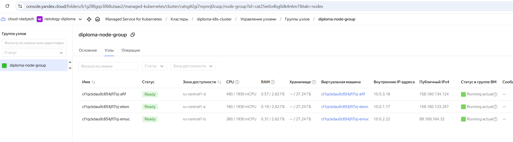

---
### Создание тестового приложения
Для перехода к следующему этапу необходимо подготовить тестовое приложение, эмулирующее основное приложение разрабатываемое компанией.
Способ подготовки:
1. Рекомендуемый вариант:  
   а. Создадим отдельный git репозиторий с простым nginx конфигом, который будет отдавать статические данные.   
https://github.com/vldzh/test-nginx-app
cat > nginx.conf << EOF
server {
    listen 80;
    server_name localhost;
    root /usr/share/nginx/html;
    index index.html;

    location / {
        try_files \$uri \$uri/ =404;
    }
}
EOF

   б. Подготовьте Dockerfile для создания образа приложения.  
```
vlad@DESKTOP-2V70QV1:~/netology/test-nginx-app$ cat Dockerfile 
# Используем официальный образ nginx
FROM nginx:alpine

# Копируем кастомную конфигурацию nginx
COPY ./nginx.conf /etc/nginx/conf.d/default.conf

# Копируем статические файлы приложения
COPY ./index.html /usr/share/nginx/html/index.html

# Открываем порт 80
EXPOSE 80

CMD ["nginx", "-g", "daemon off;"]
```
Создадим registry в Yandex Container Registry
```
vlad@DESKTOP-2V70QV1:~/netology/devops-diplom-yandexcloud/terraform/main$ cat registry.tf 
resource "yandex_container_registry" "diploma_registry" {
  name      = "diploma-registry"
  folder_id = var.folder_id
}

output "registry_id" {
  value = yandex_container_registry.diploma_registry.id
}
```
```
vlad@DESKTOP-2V70QV1:~/netology/devops-diplom-yandexcloud/terraform/main$ terraform apply
yandex_vpc_network.k8s_network: Refreshing state... [id=enp6u38gjosccsu8os5i]
yandex_vpc_subnet.k8s_subnet_d: Refreshing state... [id=fl8f6djca8pvq9ccq8d5]
yandex_vpc_subnet.k8s_subnet_b: Refreshing state... [id=e2lo8tpvp7m0no6vgv8b]
yandex_vpc_subnet.k8s_subnet_a: Refreshing state... [id=e9bgttt1d727pctek04v]
yandex_kubernetes_cluster.k8s_cluster: Refreshing state... [id=catsg42gi7mpnnj0cuqc]
yandex_kubernetes_node_group.k8s_node_group: Refreshing state... [id=cat25ie0o4bg0dk4n6m7]

Terraform used the selected providers to generate the following execution plan. Resource actions are indicated with the following symbols:
  + create

Terraform will perform the following actions:

  # yandex_container_registry.diploma_registry will be created
  + resource "yandex_container_registry" "diploma_registry" {
      + created_at  = (known after apply)
      + folder_id   = "b1.................."
      + id          = (known after apply)
      + labels      = (known after apply)
      + name        = "diploma-registry"
      + registry_id = (known after apply)
      + status      = (known after apply)
    }

Plan: 1 to add, 0 to change, 0 to destroy.

Changes to Outputs:
  + registry_id                      = (known after apply)

Do you want to perform these actions?
  Terraform will perform the actions described above.
  Only 'yes' will be accepted to approve.

  Enter a value: yes

yandex_container_registry.diploma_registry: Creating...
yandex_container_registry.diploma_registry: Creation complete after 5s [id=crp12lptvmh9j0d4te0j]

Apply complete! Resources: 1 added, 0 changed, 0 destroyed.

Outputs:

k8s_cluster_external_v4_endpoint = "https://158.160.183.7"
k8s_cluster_id = "cats................."
k8s_cluster_name = "diploma-k8s-cluster"
network_id = "enp.................."
network_name = "k8s-network"
registry_id = "cr.................."
subnet_a_id = "e9bgttt1d727pctek04v"
subnet_b_id = "e2lo8tpvp7m0no6vgv8b"
subnet_cidrs = {
  "ru-central1-a" = tolist([
    "10.0.1.0/24",
  ])
  "ru-central1-b" = tolist([
    "10.0.2.0/24",
  ])
  "ru-central1-d" = tolist([
    "10.0.3.0/24",
  ])
}
subnet_d_id = "fl8f6djca8pvq9ccq8d5"
subnet_ids = {
  "a" = "e9bgttt1d727pctek04v"
  "b" = "e2lo8tpvp7m0no6vgv8b"
  "d" = "fl8f6djca8pvq9ccq8d5"
}
subnets_map = {
  "ru-central1-a" = "e9bgttt1d727pctek04v"
  "ru-central1-b" = "e2lo8tpvp7m0no6vgv8b"
  "ru-central1-d" = "fl8f6djca8pvq9ccq8d5"
}
```
Получим и экспортируем registry‑id в переменную окружения
```
vlad@DESKTOP-2V70QV1:~/netology/test-nginx-ayc container registry listlist
+----------------------+------------------+----------------------+
|          ID          |       NAME       |      FOLDER ID       |
+----------------------+------------------+----------------------+
| cr.................. | diploma-registry | b1.................. |
+----------------------+------------------+----------------------+
vlad@DESKTOP-2V70QV1:~/netology/test-nginx-app$ export REGISTRY_ID=cr................
```
Соберем образ:
```
vlad@DESKTOP-2V70QV1:~/netology/test-nginx-app$ docker build -t test-nginx-app:v4 .
[+] Building 4.4s (8/8) FINISHED                                                                                                                                                                                           docker:default
 => [internal] load build definition from Dockerfile                                                                                                                                                                                 0.0s
 => => transferring dockerfile: 444B                                                                                                                                                                                                 0.0s
 => [internal] load metadata for docker.io/library/nginx:alpine                                                                                                                                                                      4.1s
 => [internal] load .dockerignore                                                                                                                                                                                                    0.0s
 => => transferring context: 78B                                                                                                                                                                                                     0.0s
 => CACHED [1/3] FROM docker.io/library/nginx:alpine@sha256:8491795299c8e739b7fcc6285d531d9812ce2666e07bd3dd8db00020ad132295                                                                                                         0.0s
 => [internal] load build context                                                                                                                                                                                                    0.0s
 => => transferring context: 370B                                                                                                                                                                                                    0.0s
 => [2/3] COPY ./nginx.conf /etc/nginx/conf.d/default.conf                                                                                                                                                                           0.0s
 => [3/3] COPY ./index.html /usr/share/nginx/html/index.html                                                                                                                                                                         0.1s
 => exporting to image                                                                                                                                                                                                               0.1s
 => => exporting layers                                                                                                                                                                                                              0.0s
 => => writing image sha256:20aab0723402d1a2781aebaf453aee300b9a4edb2fb5faffacefac94b3985363                                                                                                                                         0.0s
 => => naming to docker.io/library/test-nginx-app:v4  
```
Авторизуемся в Container Registry:
```
vlad@DESKTOP-2V70QV1:~/netology/test-nginx-app$ yc container registry configure-docker
docker configured to use yc --profile "default" for authenticating "cr.yandex" container registries
Credential helper is configured in '/home/vlad/.docker/config.json'
```
```                                                                                                                                                                              0.0s
                                                                                                                                                                              0.0s
vlad@DESKTOP-2V70QV1:~/netology/test-nginx-app$ docker tag test-nginx-app:v4 cr.yandex/crp12lptvmh9j0d4te0j/test-nginx-app:v4
vlad@DESKTOP-2V70QV1:~/netology/test-nginx-app$ docker push cr.yandex/crp12lptvmh9j0d4te0j/test-nginx-app:v4
The push refers to repository [cr.yandex/crp12lptvmh9j0d4te0j/test-nginx-app]
94f41366d4a5: Pushed 
da2d14fffdc8: Pushed 
e6fe11fa5b7f: Layer already exists 
67ea0b046e7d: Layer already exists 
ed5fa8595c7a: Layer already exists 
8ae63eb1f31f: Layer already exists 
b3e3d1bbb64d: Layer already exists 
48078b7e3000: Layer already exists 
fd1e40d7f74b: Layer already exists 
7bb20cf5ef67: Layer already exists 
v4: digest: sha256:600450b336b27d5c65aaf98adef959abf67182ad87cd22c3c024be30e921038e size: 2403
vlad@DESKTOP-2V70QV1:~/netology/test-nginx-app$ kubectl set image deployment/test-nginx-app test-nginx-app=cr.yandex/crp12lptvmh9j0d4te0j/test-nginx-app:v4
deployment.apps/test-nginx-app image updated
```
Ожидаемый результат:

1. Git репозиторий с тестовым приложением и Dockerfile.
2. Регистри с собранным docker image. В качестве регистри - Yandex Container Registry](https://cloud.yandex.ru/services/container-registry), созданный также с помощью terraform.

---
### Подготовка cистемы мониторинга и деплой приложения

Уже должны быть готовы конфигурации для автоматического создания облачной инфраструктуры и поднятия Kubernetes кластера.  
Теперь необходимо подготовить конфигурационные файлы для настройки нашего Kubernetes кластера.

Цель:
1. Задеплоить в кластер [prometheus](https://prometheus.io/), [grafana](https://grafana.com/), [alertmanager](https://github.com/prometheus/alertmanager), [экспортер](https://github.com/prometheus/node_exporter) основных метрик Kubernetes.

Добавим репозиторий и установим стек:
```
vlad@DESKTOP-2V70QV1:~/netology/test-nginx-app$ helm repo add prometheus-community https://prometheus-community.github.io/helm-charts
helm repo update
"prometheus-community" has been added to your repositories
Hang tight while we grab the latest from your chart repositories...
...Successfully got an update from the "prometheus-community" chart repository
Update Complete. ⎈Happy Helming!⎈

vlad@DESKTOP-2V70QV1:~/netology/test-nginx-app$ kubectl create namespace monitoring
namespace/monitoring created

vlad@DESKTOP-2V70QV1:~/netology/test-nginx-app$ helm install prometheus prometheus-community/kube-prometheus-stack   --namespace monitoring   --set prometheus.service.type=LoadBalancer   --set grafana.service.type=LoadBalancer
NAME: prometheus
LAST DEPLOYED: Tue Dec 30 22:17:36 2025
NAMESPACE: monitoring
STATUS: deployed
REVISION: 1
NOTES:
kube-prometheus-stack has been installed. Check its status by running:
  kubectl --namespace monitoring get pods -l "release=prometheus"

Get Grafana 'admin' user password by running:

  kubectl --namespace monitoring get secrets prometheus-grafana -o jsonpath="{.data.admin-password}" | base64 -d ; echo

Access Grafana local instance:

  export POD_NAME=$(kubectl --namespace monitoring get pod -l "app.kubernetes.io/name=grafana,app.kubernetes.io/instance=prometheus" -oname)
  kubectl --namespace monitoring port-forward $POD_NAME 3000

Get your grafana admin user password by running:

  kubectl get secret --namespace monitoring -l app.kubernetes.io/component=admin-secret -o jsonpath="{.items[0].data.admin-password}" | base64 --decode ; echo


Visit https://github.com/prometheus-operator/kube-prometheus for instructions on how to create & configure Alertmanager and Prometheus instances using the Operator.
vlad@DESKTOP-2V70QV1:~/netology/test-nginx-app$ kubectl get pods -n monitoring
NAME                                                     READY   STATUS    RESTARTS   AGE
alertmanager-prometheus-kube-prometheus-alertmanager-0   2/2     Running   0          73s
prometheus-grafana-78c79d8578-rthc4                      3/3     Running   0          75s
prometheus-kube-prometheus-operator-64cc94fdcb-bcx49     1/1     Running   0          75s
prometheus-kube-state-metrics-698d844f6b-zmdtc           1/1     Running   0          75s
prometheus-prometheus-kube-prometheus-prometheus-0       2/2     Running   0          73s
prometheus-prometheus-node-exporter-56ft8                1/1     Running   0          75s
prometheus-prometheus-node-exporter-d92xx                1/1     Running   0          75s
prometheus-prometheus-node-exporter-kdtcd                1/1     Running   0          75s
vlad@DESKTOP-2V70QV1:~/netology/test-nginx-app$ kubectl get services -n monitoring
NAME                                      TYPE           CLUSTER-IP      EXTERNAL-IP       PORT(S)                         AGE
alertmanager-operated                     ClusterIP      None            <none>            9093/TCP,9094/TCP,9094/UDP      78s
prometheus-grafana                        LoadBalancer   10.96.162.211   158.160.177.176   80:30371/TCP                    80s
prometheus-kube-prometheus-alertmanager   ClusterIP      10.96.195.231   <none>            9093/TCP,8080/TCP               80s
prometheus-kube-prometheus-operator       ClusterIP      10.96.135.105   <none>            443/TCP                         80s
prometheus-kube-prometheus-prometheus     LoadBalancer   10.96.241.106   158.160.193.148   9090:30185/TCP,8080:30932/TCP   80s
prometheus-kube-state-metrics             ClusterIP      10.96.150.151   <none>            8080/TCP                        80s
prometheus-operated                       ClusterIP      None            <none>            9090/TCP                        78s
prometheus-prometheus-node-exporter       ClusterIP      10.96.254.78    <none>            9100/TCP                        80s
```
Определим IP-адрес UI Grafana и пароль администратора
```
vlad@DESKTOP-2V70QV1:~/netology/test-nginx-app$ kubectl get service -n monitoring prometheus-grafana -o jsonpath='{.status.loadBalancer.ingress[0].ip}'
158.160.177.176
vlad@DESKTOP-2V70QV1:~/netology/test-nginx-app$ kubectl --namespace monitoring get secrets prometheus-grafana -o jsonpath="{.data.admin-password}" | base64 -d ; echo
I0......................
```
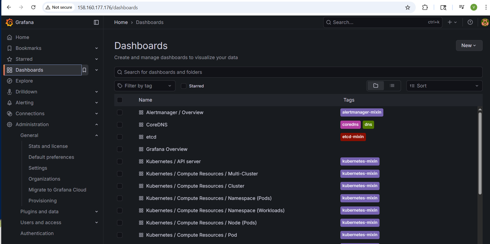
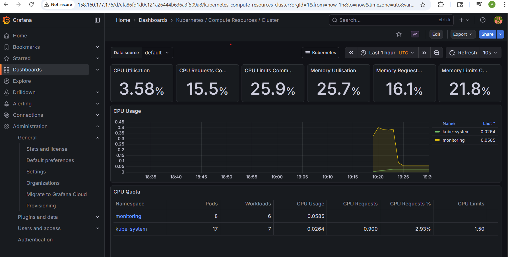

2. Задеплоим тестовое приложение nginx, сервер отдающий статическую страницу.
```
cd ~/diploma-project/test-nginx-app/k8s
```
Создадим манифесты
```
vlad@DESKTOP-2V70QV1:~/netology/test-nginx-app$ cat k8s/deployment.yaml 
apiVersion: apps/v1
kind: Deployment
metadata:
  name: test-nginx-app
  namespace: default
spec:
  replicas: 2
  selector:
    matchLabels:
      app: test-nginx-app
  template:
    metadata:
      labels:
        app: test-nginx-app
    spec:
      containers:
      - name: test-nginx-app
        image: cr.yandex/crp12lptvmh9j0d4te0j/test-nginx-app:v3
        ports:
        - containerPort: 80
        resources:
          requests:
            memory: "64Mi"
            cpu: "100m"
          limits:
            memory: "128Mi"
            cpu: "200m"
```
```
vlad@DESKTOP-2V70QV1:~/netology/test-nginx-app$ cat k8s/service.yaml 

apiVersion: v1
kind: Service
metadata:
  name: test-nginx-svc
  namespace: default
spec:
  type: LoadBalancer
  ports:
  - port: 80
    targetPort: 80
  selector:
    app: test-nginx-app
```

Развернем приложения
```
kubectl apply -f k8s/deployment.yaml
kubectl apply -f k8s/service.yaml
```
Проверим
```
vlad@DESKTOP-2V70QV1:~/netology/test-nginx-app$ kubectl get deployments
NAME             READY   UP-TO-DATE   AVAILABLE   AGE
test-nginx-app   2/2     2            2           21m

vlad@DESKTOP-2V70QV1:~/netology/test-nginx-app$ kubectl get pods
NAME                              READY   STATUS    RESTARTS   AGE
test-nginx-app-75bc8dcc8c-8w87f   1/1     Running   0          11m
test-nginx-app-75bc8dcc8c-qqp52   1/1     Running   0          11m


vlad@DESKTOP-2V70QV1:~/netology/test-nginx-app$ kubectl get services
NAME             TYPE           CLUSTER-IP     EXTERNAL-IP       PORT(S)        AGE
kubernetes       ClusterIP      10.96.128.1    <none>            443/TCP        6h34m
test-nginx-svc   LoadBalancer   10.96.194.59   158.160.136.102   80:30533/TCP   91m
```
```
vlad@DESKTOP-2V70QV1:~/netology/test-nginx-app$ curl http://158.160.136.102 
<!DOCTYPE html><html><head><title>TEST NGINX APP</title></head><body><h1>HAPPY NEW YEAR!</h1></body></html>
```

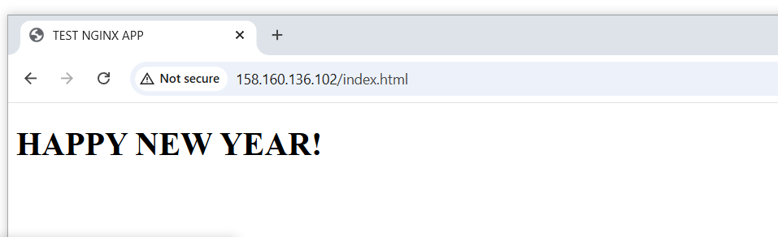

### Деплой инфраструктуры в terraform pipeline

1. настройте на автоматический запуск и применение конфигурации terraform из вашего git-репозитория в выбранной вами CI-CD системе при любом комите в main ветку. Предоставьте скриншоты работы пайплайна из CI/CD системы.
Выберем GitHub Actions 

Ожидаемый результат:
1. Git репозиторий с конфигурационными файлами для настройки Kubernetes.
2. Http доступ на 80 порту к web интерфейсу grafana.
3. Дашборды в grafana отображающие состояние Kubernetes кластера.
4. Http доступ на 80 порту к тестовому приложению.
5. terraform cloud или ci/cd-terraform
---
### Установка и настройка CI/CD

Осталось настроить ci/cd систему для автоматической сборки docker image и деплоя приложения при изменении кода.
Цель:
1. Автоматическая сборка docker образа при коммите в репозиторий с тестовым приложением.
2. Автоматический деплой нового docker образа.
Используем Github actions
Cоздадим новый сервисный аккаунт github-actions-sa специально для GitHub Actions
```
vlad@DESKTOP-2V70QV1:~/netology/test-nginx-app$ yc iam service-account create \
  --name github-actions-sa \
  --description "Dedicated SA for GitHub Actions CI/CD"
done (2s)
id: aj..................
folder_id: b................
created_at: "2025-12-30T23:24:41Z"
name: github-actions-sa
description: Dedicated SA for GitHub Actions CI/CD
```
Назначаем роли
```
vlad@DESKTOP-2V70QV1:~/netology/test-nginx-app$ FOLDER_ID=$(yc config get folder-id)
GASA_ID=$(yc iam service-account get github-actions-sa --format json | jq -r .id)

vlad@DESKTOP-2V70QV1:~/netology/test-nginx-app$ yc resource-manager folder add-access-binding $FOLDER_ID \
  --role container-registry.admin \
  --subject serviceAccount:$GASA_ID

done (2s)
effective_deltas:
  - action: ADD
    access_binding:
      role_id: container-registry.admin
      subject:
        id: aj.................
        type: serviceAccount

vlad@DESKTOP-2V70QV1:~/netology/test-nginx-app$ yc resource-manager folder add-access-binding $FOLDER_ID \
  --role       k8s.cluster-api.cluster-admin   
  --subject serviceAccount:$GASA_ID
done (2s)
effective_deltas:
  - action: ADD
    access_binding:
      role_id: k8s.cluster-api.cluster-admin
      subject:
        id: a.....................
        type: serviceAccount
```
Генерируем JSON ключ 
```
vlad@DESKTOP-2V70QV1:~/netology/test-nginx-app$ yc iam key create --service-account-name github-actions-sa --output key.json
id: aj...............
service_account_id: aj..................
created_at: "2025-12-31T23:43:25.882471212Z"
key_algorithm: RSA_2048

vlad@DESKTOP-2V70QV1:~/netology/test-nginx-app$ base64 -w 0 key.json
ew>....
```
Добавим секреты в GitHub (репозиторий vldzh/test-nginx-app)
```
# 1. YC_CLOUD_ID
yc resource-manager cloud list

# 2. YC_FOLDER_ID  
yc resource-manager folder list

# 3. YC_K8S_CLUSTER_ID
yc managed-kubernetes cluster list

# 4. YC_REGISTRY_ID
yc container registry list

# 5. YC_SERVICE_ACCOUNT_KEY (создание)
# Создать ключ и закодировать в base64
yc iam key create --service-account-name github-actions-sa -o json | base64 -w 0
```
Перейдем в: GitHub → Settings → Secrets and variables → Actions → New repository secret
Создадим скреты
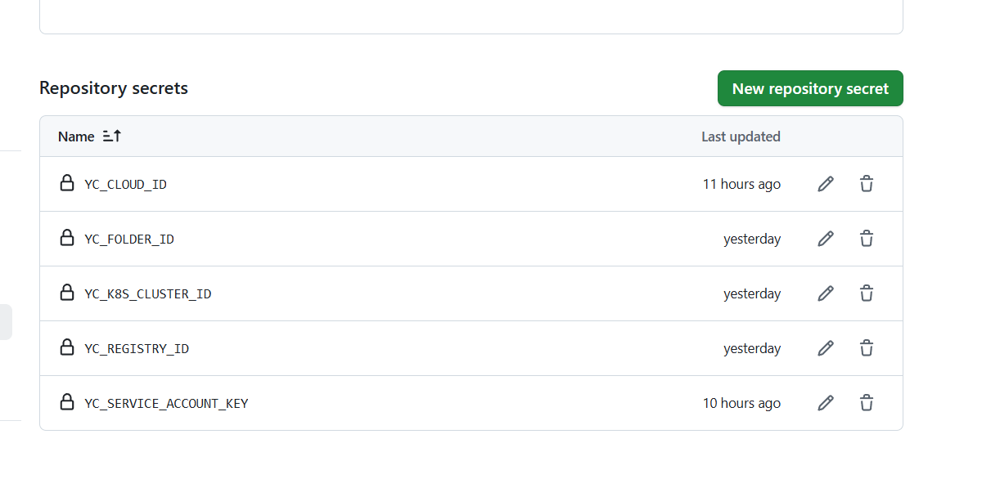
Создаим .github/workflows/cicd.yaml
Ghb k.ljv rjvvbnt
```
name: CI/CD — Build & Deploy to Yandex Kubernetes

on:
  push:
    branches:
      - main
  workflow_dispatch:

env:
  IMAGE_NAME: test-nginx-app

jobs:
  build-and-deploy:
    runs-on: ubuntu-latest
    env:
      YC_CLOUD_ID:       ${{ secrets.YC_CLOUD_ID }}
      YC_FOLDER_ID:      ${{ secrets.YC_FOLDER_ID }}
      YC_K8S_CLUSTER_ID: ${{ secrets.YC_K8S_CLUSTER_ID }}
      YC_REGISTRY_ID:    ${{ secrets.YC_REGISTRY_ID }}

    steps:
      - name: Checkout code
        uses: actions/checkout@v4

      - name: Set up Docker Buildx
        uses: docker/setup-buildx-action@v3

      - name: Install yc CLI
        run: |
          curl -sSL https://storage.yandexcloud.net/yandexcloud-yc/install.sh | bash
          echo "$HOME/yandex-cloud/bin" >> $GITHUB_PATH

      - name: Restore SA key from secret
        run: |
          echo "$YC_SERVICE_ACCOUNT_KEY" | base64 -d > sa-key.json
        env:
          YC_SERVICE_ACCOUNT_KEY: ${{ secrets.YC_SERVICE_ACCOUNT_KEY }}

      - name: Authenticate yc CLI with service account key
        run: |
          yc config set cloud-id $YC_CLOUD_ID
          yc config set folder-id $YC_FOLDER_ID
          yc config set service-account-key sa-key.json

      - name: Configure Docker for Yandex Container Registry
        run: yc container registry configure-docker

      - name: Build and push Docker image (commit hash + latest)
        run: |
          COMMIT_SHORT=${GITHUB_SHA::8}
          REGISTRY=cr.yandex/$YC_REGISTRY_ID
          IMAGE_COMMIT=$REGISTRY/$IMAGE_NAME:$COMMIT_SHORT
          IMAGE_LATEST=$REGISTRY/$IMAGE_NAME:latest

          docker build -t "$IMAGE_COMMIT" -t "$IMAGE_LATEST" .
          docker push "$IMAGE_COMMIT"
          docker push "$IMAGE_LATEST"

      - name: Get kubeconfig for Yandex Kubernetes
        run: yc managed-kubernetes cluster get-credentials $YC_K8S_CLUSTER_ID --external

      - name: Restart deployment to pull new :latest image
        run: kubectl rollout restart deployment/test-nginx-app
```

Пошаговое описание процесса
Шаг 1: Триггеры запуска
Автоматический запуск (push): Пайплайн запускается автоматически каждый раз, когда разработчик заливает изменения (git push) в ветку main.
Ручной запуск (workflow_dispatch): Пайплайн можно запустить вручную через интерфейс GitHub Actions (кнопка "Run workflow").

Шаг 2: Подготовка среды
Создается новая, чистая виртуальная машина с операционной системой Ubuntu.
На ней инициализируется рабочий процесс (job) с именем build-and-deploy.
В переменные окружения загружаются важные идентификаторы от Yandex Cloud, которые хранятся в секретах репозитория GitHub (никто посторонний их не видит).

Шаг 3: Получение кода (Checkout code)
На виртуальную машину копируется (клонируется) последняя версия кода проекта из репозитория GitHub.

Шаг 4: Настройка Docker (Set up Docker Buildx)
Устанавливается и настраивается современный инструмент для сборки Docker-образов (Buildx), который ускоряет процесс.

Шаг 5: Установка инструмента Yandex Cloud CLI (Install yc CLI)dfi

Шаг 6: Работа с ключом доступа (Restore SA key... / Authenticate yc CLI...)
Из секрета GitHub извлекается и расшифровывается ключ сервисного аккаунта Yandex Cloud (специального пользователя с правами на управление инфраструктурой).
Этот ключ сохраняется в файл sa-key.json на виртуальной машине.
Инструмент yc настраивается на использование этого ключа и указанных ранее идентификаторов облака и каталога. Теперь система может от имени  проекта выполнять действия в Yandex Cloud.

Шаг 7: Настройка доступа к реестру контейнеров (Configure Docker...)
Локальный Docker настраивается для работы с приватным Yandex Container Registry (CR). После этого команды docker push/pull будут работать с  реестром в Yandex Cloud.

Шаг 8: Сборка и публикация Docker-образа (Build and push Docker image)
Создается Docker-образ приложения на основе Dockerfile
Образу присваиваются две метки (теги):
Уникальный тег по хэшу коммита (например, test-nginx-app:a1b2c3d4). Позволяет точно идентифицировать образ, собранный из конкретной версии кода.
Тег latest (например, test-nginx-app:latest). "Плавающий" тег, указывающий на самую свежую сборку.
Оба образа загружаются (push) в приватный Container Registry в Yandex Cloud.

Шаг 9: Подключение к Kubernetes (Get kubeconfig...)
Система получает доступ к кластеру Yandex Managed Kubernetes.
Команда yc скачивает конфигурационный файл (kubeconfig), после чего утилита kubectl (автоматически доступная в среде) может управлять кластером.

Шаг 10: Обновление приложения в кластере (Restart deployment...)
Выполняется ключевая команда обновления: kubectl rollout restart deployment/test-nginx-app.
Что это делает:
Kubernetes получает указание перезапустить все Pod'ы (контейнеры) в развертывании (deployment) с именем test-nginx-app.
При создании новых Pod'ов Kubernetes замечает, что у образа в реестре изменился тег latest, и скачивает его новую версию.
Происходит плавное (rolling update) обновление: старые Pod'ы останавливаются только после успешного запуска новых, что гарантирует отсутствие простоя приложения.

Итог:
Через несколько минут после git push  обновленное приложение автоматически, безопасно и без простоя начинает работать в продакшн-среде Yandex Cloud Kubernetes.


---
## Что необходимо для сдачи задания?

1. Репозиторий с конфигурационными файлами Terraform и готовность продемонстрировать создание всех ресурсов с нуля.
https://github.com/vldzh/devops-diplom-yandexcloud
2. Пример pull request или снимки экрана из Terraform Cloud или вашего CI-CD-terraform pipeline.
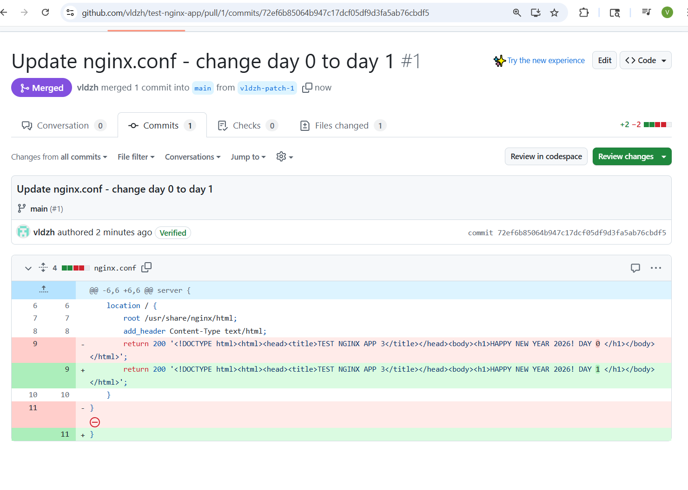
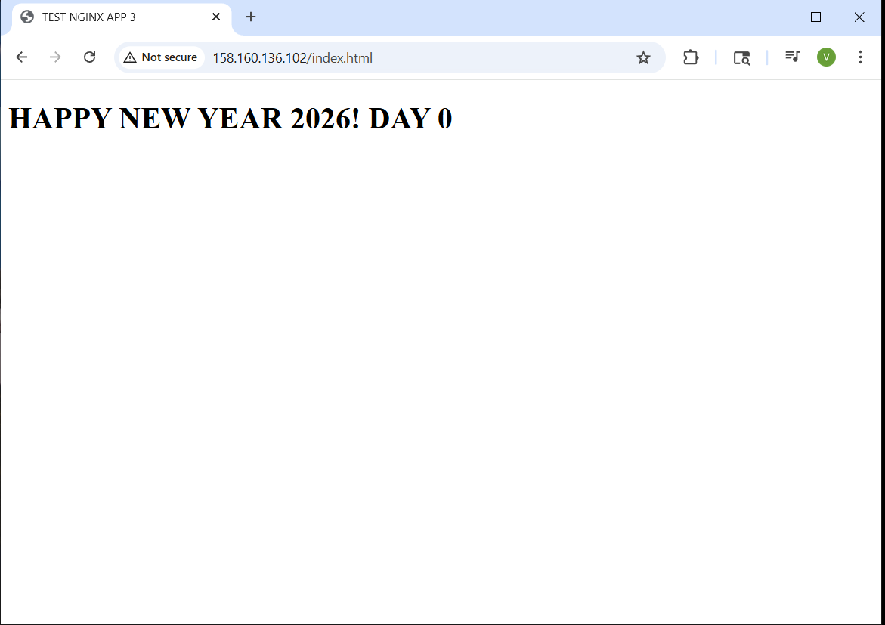
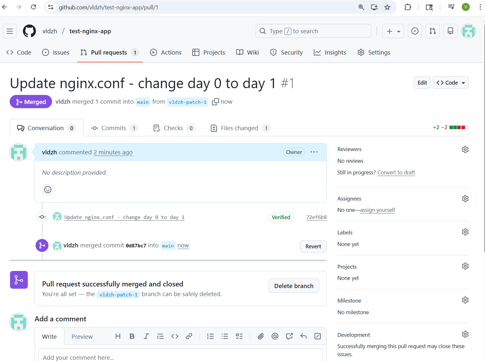
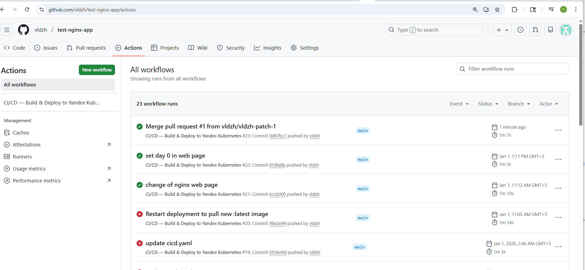
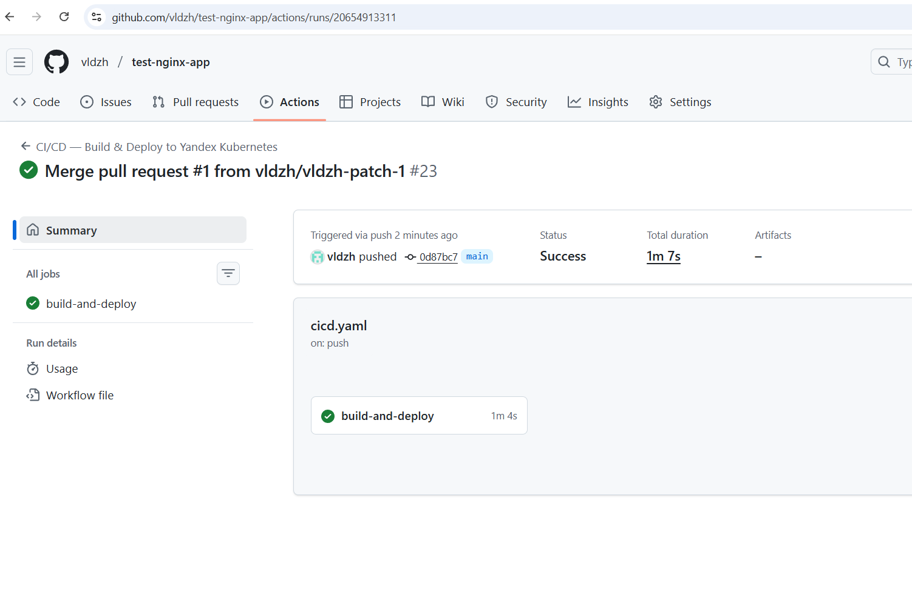
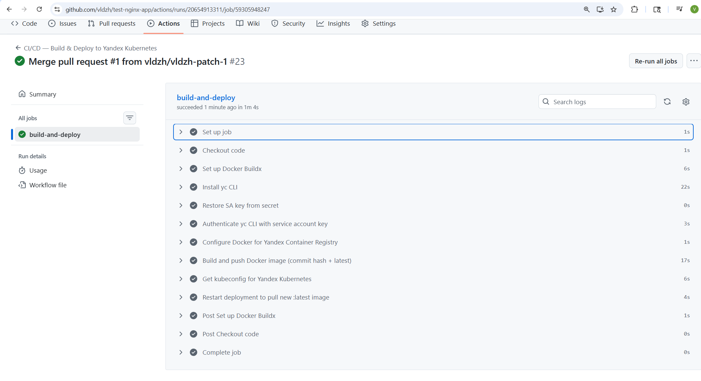
3. Репозиторий с конфигурацией ansible, если был выбран способ создания Kubernetes кластера при помощи ansible.
4. Репозиторий с Dockerfile тестового приложения и ссылка на собранный docker image.
https://github.com/vldzh/test-nginx-app
https://cr.yandex/v2/crp12lptvmh9j0d4te0j/test-nginx-app/tags/list
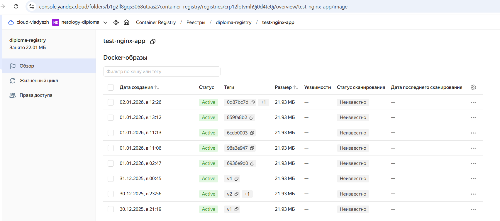
5. Репозиторий с конфигурацией Kubernetes кластера.
https://github.com/vldzh/devops-diplom-yandexcloud/tree/main/terraform/main
6. Ссылка на тестовое приложение и веб интерфейс Grafana с данными доступа.
http://158.160.171.29/index.html  - тестовое приложение 
http://158.160.147.64/login  - веб интерфейс Grafana 
7. Все репозитории рекомендуется хранить на одном ресурсе github


